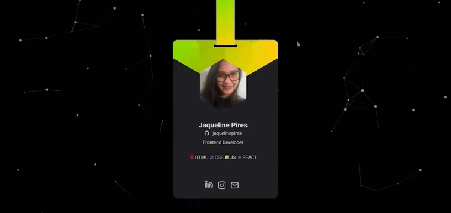

<h1 align="center">
  crach-nlw - Desktop
</h1>

  <a href="#-tecnologias">Tecnologias</a>&nbsp;&nbsp;&nbsp;|&nbsp;&nbsp;&nbsp;
  <a href="#-projeto">Projeto</a>&nbsp;&nbsp;&nbsp;|&nbsp;&nbsp;&nbsp;
  <a href="#-layout">Layout</a>&nbsp;&nbsp;&nbsp;|&nbsp;&nbsp;&nbsp;
  <a href="#-licença">Licença</a>

 
  
  

  

 

  

## 🚀 Tecnologias

Esse projeto foi desenvolvido com as seguintes tecnologias:

- HTML
- CSS
- JavaScript
- [Particles.js](https://github.com/VincentGarreau/particles.js/)
- [Vanilla-tilt](https://micku7zu.github.io/vanilla-tilt.js/index.html)

## 💻 Projeto

O Crachá virtual é uma aplicação estatica com o objetivo de mostrar as informações do usuário trazidas do GitHub API e inseri-lás em um layout.

## 🔖 Layout

Link: https://jaquelinepires.github.io/crach-nlw/

## 📝 Licença

Esse projeto está sob a licença MIT. Veja o arquivo [LICENSE](.github/LICENSE.md) para mais detalhes.

---

Feito com 💙 by Jaqueline Pires

